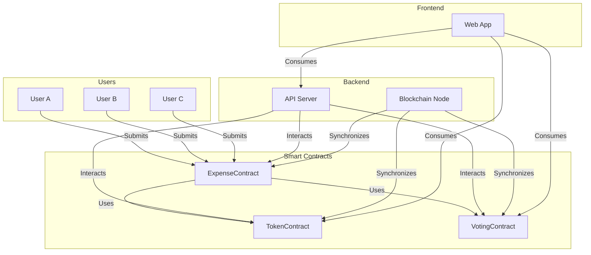

# Expense Management System using Blockchain Technology

This repository contains the code for implementing a decentralized expense management system using blockchain technology. The objective of this project is to enhance transparency, reduce fraud, and automate approval workflows in the expense management process.

## Table of Contents
- [Project Description](#project-description)
- [Installation and Setup](#installation-and-setup)
- [Usage](#usage)
- [Contributing](#contributing)
- [License](#license)

## Project Description
The main goal of this project is to implement a decentralized expense management system using blockchain technology. By leveraging blockchain, we aim to achieve the following key features:

- **Blockchain Integration**: Integrate blockchain technology to establish a decentralized ledger for recording and storing expense transactions.
- **Smart Contracts for Approval Workflows**: Implement smart contracts to automate approval workflows based on predefined rules and conditions.
- **Immutable Receipt Storage**: Utilize decentralized storage solutions on the blockchain for storing receipts, ensuring immutability and tamper-proofing.
- **Tokenized Incentives or Rewards**: Integrate tokenization for creating incentives or rewards associated with compliant expense reporting and approvals.
- **Decentralized Identity for Verification**: Utilize decentralized identity solutions for secure and privacy-centric user verification within the expense management system.

## Installation and Setup
To install and run the expense management system locally, follow these steps:

1. Clone this repository.
2. Install the required dependencies using the package manager of your choice.
3. Set up the blockchain integration by configuring the necessary connection parameters.
4. Deploy the smart contracts to the blockchain network.
5. Set up and configure the decentralized storage solutions for storing receipts.
6. Run the application and access it via the provided URL.

## Usage
Once the expense management system is installed and running, follow these instructions:

1. Create an account or log in to an existing account.
2. Submit expense transactions and relevant details, including receipts.
3. The smart contracts will automatically trigger approval workflows based on the predefined rules and conditions.
4. Users can track the status of their submitted expenses and view approval updates in real-time.
5. Tokenized incentives or rewards will be generated and distributed for compliant expense reporting and approvals.
6. Users can explore decentralized identity solutions for secure and privacy-centric user verification.

## Contributing
We welcome contributions from the community. If you would like to contribute to the development of this project, please follow these guidelines:

1. Fork the repository and create a new branch.
2. Make your changes, adding new features or fixing bugs.
3. Ensure that your code follows the project's coding conventions and best practices.
4. Write unit tests to validate your changes.
5. Commit your changes and create a pull request, explaining the purpose and scope of your contribution.

## License
This project is licensed under the [MIT License](LICENSE). Feel free to use, modify, and distribute this code for personal or commercial purposes.